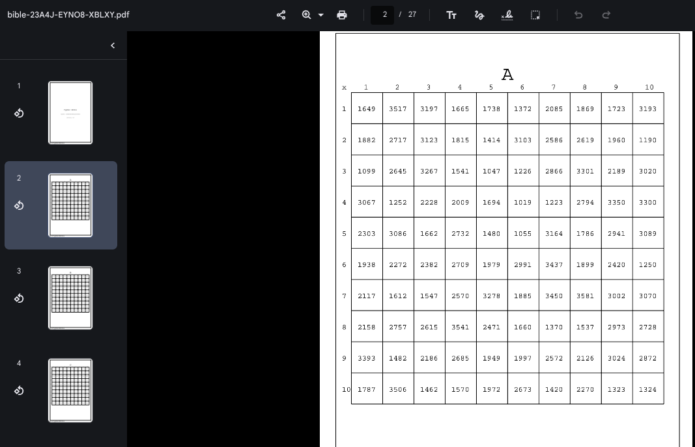

# AutoCypherBible
A little tool I made to generate complex numerical cyphers, in PDF form.

## How to use?
install numpy and rlextra from reportlab (https://www.reportlab.com/)  
run bible.py  
unless you broke something, it should output a pdf & the jsonified mappings (to programatically encode/decode instead of manually doing it)  
### Automatically
Generate the bible, blah blah blah.  
Grab the JSON file's name and run this to encode:  
``python3 jsoncrypter.py FILENAME encode TEXT``  
run this to decode:  
``python3 jsoncrypter.py FILENAME decode ENCODED-TEXT``  

